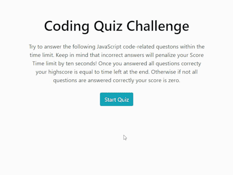

# Code Quiz 
**Code Quiz** - timed coding quiz with multiple-choice questions. This app runs in the browser, and feature dynamically updated HTML and CSS powered by JavaScript. This is timed quiz on JavaScript fundamentals that stores high scores for the user taking Quiz.

## Installation

Website can be accessed at [elogonme.github.io/code-quiz/](https://elogonme.github.io/code-quiz/)

## Usage 
Try answer the following code-related questions with the time limit using mouse to click on correct answer. Keep in mind that incorrect answers will penalize your score time by ten seconds. Enter your name at the end of quiz to store your score.

## Repository
All the `code` is available at repository [github.com/elogonme/code-quiz](https://github.com/elogonme/password-generator)
## Credits

Coded by Eldar Humbatov [github.com/elogonme](https://github.com/elogonme)

## License

This source code is available to everyone under the standard 
